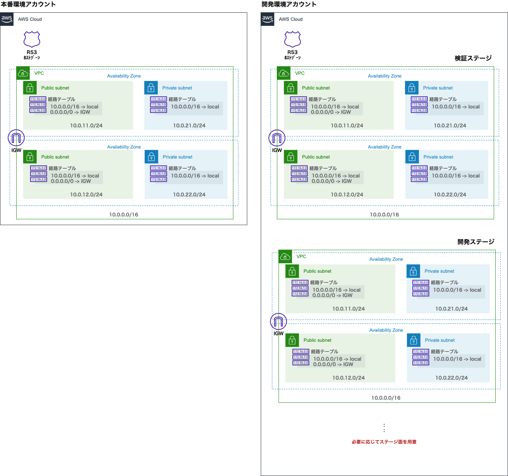

# CDK Sample Project for PEXA

## CDK
The `cdk.json` file tells the CDK Toolkit how to execute your app.
### Useful commands

* `npm run build`   compile typescript to js
* `npm run watch`   watch for changes and compile
* `npm run test`    perform the jest unit tests
* `cdk deploy`      deploy this stack to your default AWS account/region
* `cdk diff`        compare deployed stack with current state
* `cdk synth`       emits the synthesized CloudFormation template

## AWS環境について

AWSアカウントは、複数の世界中の物理データセンターを仮想的にユーザーアカウント内で利用することができます。
ここからの例では一部の例外を除き、すべて東京リージョンを利用します。

### アーキテクチャ
この例では基本的な3-Tier構成を以下のコンポーネントを利用することで実現します。

#### ネットワーク
- Amazon VPC(Virtual Private Cloud)
    - AWSが提供する仮想ネットワーク(SD-LAN)です
    - ここでは10.0.0.0/16で大枠のVPCを作成した後で、/24のCIDR分割で複数のサブネットを作成します。
    - サブネットにインターネットゲートウェイとの通信経路が定義されている(0.0.0.0/0->IGW)サブネットをパブリックサブネット。ないもの(10.0.0.0/16内しか経路がない)をプライベートサブネットと呼びます。
    - サブネットはAZ単位で作成する必要があるため、同じ機能を配置する複数のサブネットを、複数のAZに分散して作成することで、地理的冗長性を担保します。
- Route 53
    - インターネットからこのアプリに接続するための名前解決に利用します。当該ドメイン(サブドメイン)の名前解決先として以下のALBを指定します。
- Elastic Load Balancing(Application Load Balancer)
    - ドメインの名前解決がされて接続されるIPアドレスの実体はこのALBです。複数のAZにまたがるため複数のIPアドレスを返しますが、TLSの終端と、内部でECSコンテナへのリクエストのルーティングをおこないます。

### 環境
- 必要に応じて複数のアカウント、VPCを利用します。
- すべてのVPCは基本的に同一のネットワーク構成を持つことで可能な限り環境差異をなくします。

